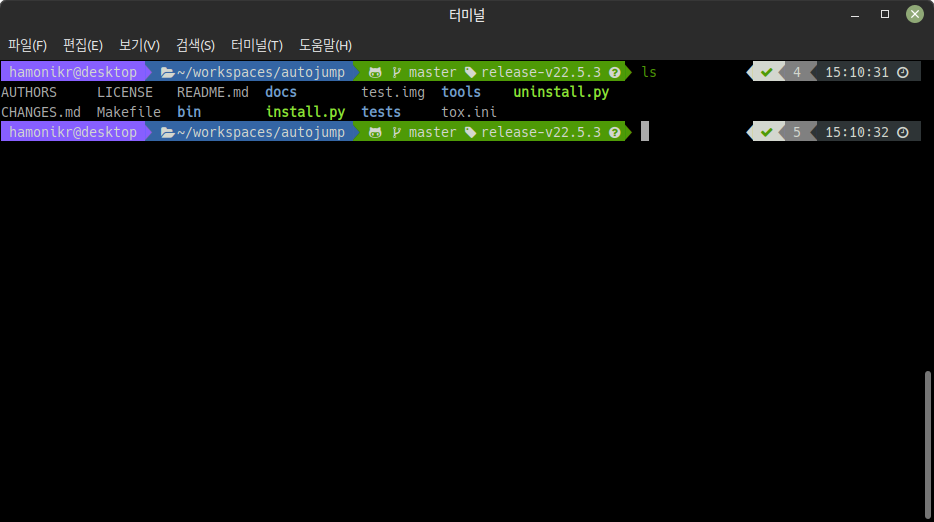

# hamonikr-zsh

macOS 버전 10.15 인 ‘카탈리나’ 부터 기본 쉘 (Shell) 이 bash1 에서 zsh (Z shell)
로 변경 되었습니다. 

이 프로그램은 하모니카 사용자에게 터미널 환경의 사용성을 개선해주는 zsh 프로그램
입니다.

Zsh에는 Git용 탭 자동완성 스크립트가 들어 있습니다. 

```
$ git che<tab>
check-attr        -- display gitattributes information
check-ref-format  -- ensure that a reference name is well formed
checkout          -- checkout branch or paths to working tree
checkout-index    -- copy files from index to working directory
cherry            -- find commits not merged upstream
cherry-pick       -- apply changes introduced by some existing commits
```

Zsh은 선택지가 여러 개일 때 간단한 설명도 함께 보여주고 탭 키로 고를 수 있습니다. 
또한 Git 명령어만이 아니라 아규먼트도 자동완성해주며 저장소의 리모트나 Refs
이름과 파일 이름 같은 것도 자동완성합니다. 


쉘에서 Git 저장소 디렉토리로 이동하면 터미널 오른쪽에 현 브랜치 이름을 보여줍니다.



## 주요기능

 * zsh 기본 터미널과 필요한 플러그인 자동 설치
 * powerline fonts 포함
 * zsh-theme-powerlevel9k 테마 기본 설치
 * `CTRL + ALT + Z` 단축키로 실행

## 프로그램 설치 (Ubuntu 18.04, 하모니카 1.4, 하모니카 3.0)

하모니카 사용자는 `apt 저장소 추가 단계`가 필요없습니다.

1) 하모니카 apt 저장소를 추가하고 업데이트
```
curl -sL https://apt.hamonikr.org/setup_hamonikr.sun | sudo -E bash -
```

2) 프로그램 설치.

터미널을 열고 다음과 같이 입력하세요.
```
sudo apt install hamonikr-zsh
```

## 프로그램 삭제

```
sudo apt purge hamonikr-zsh
```

## 데비안 패키지 빌드

다운로드 받은 디렉토리 안에서 아래와 같이 빌드하면 release 폴더 안에 설치 가능한
데비안 파일 생성됩니다.


```
./build
```

## 버그 또는 이슈 제출

사용 중 발견한 버그나 이슈는 help@hamonikr.org 로 메일을 보내주세요
