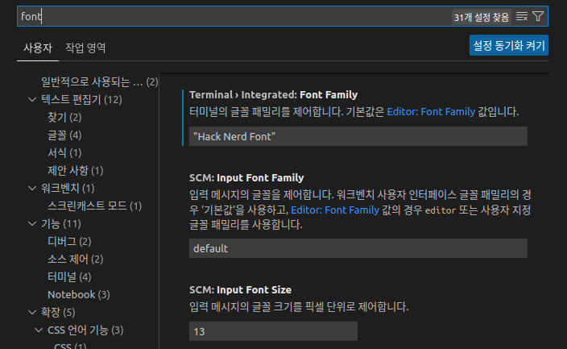

# hamonikr-zsh

macOS 버전 10.15 인 ‘카탈리나’ 부터 기본 쉘 (Shell) 이 bash 에서 zsh (Z shell) 로 변경 되었습니다. 

이 프로그램은 하모니카 사용자에게 터미널 환경의 사용성을 개선해주는 zsh 프로그램 입니다.

* 지원 환경 : Ubuntu (>=20.04) , HamoniKR (>=5.0)


## 주요기능

 * [Oh My Zsh](https://github.com/ohmyzsh/ohmyzsh/)
 * [zsh-theme-powerlevel9k](https://github.com/Powerlevel9k/powerlevel9k)
 * Using [Hack Regular Nerd Font Complete](https://github.com/ryanoasis/)
 * [autojump](https://github.com/wting/autojump) : 여러변의 cd명령을 통해서 디렉터리를 바꾸는 것을 간단히 j 명령을 통해서 한번에 이동 가능.
 * [autosuggestion](https://github.com/zsh-users/zsh-autosuggestions) : 최근에 입력한 명령어를 미리보기 형태로 보여주고 방향키를 통해 나타난 명령어라인을 빠르게 완성.
 * [syntax-highlighting](https://github.com/zsh-users/zsh-syntax-highlighting) : 명령어와 미리보기 등을 구분하기 쉽게 색상으로 표시.
 * bash-completion : 탭키를 이용해 명령어 자동 완성 기능 제공.
 * [Useful Alias](https://www.atatus.com/blog/14-useful-bash-aliases-that-make-shell-less-complex-and-more-fun/) : 자주 사용하는 명령어 축약 기능


zsh 는 쉘에서 Git 저장소 디렉토리로 이동하면 터미널 오른쪽에 현 브랜치 이름을 보여주고, 다음과 같은 Git 탭 자동완성 스크립트가 포함되어 있어서 소프트웨어 개발자에게 편의성을 제공합니다.

```
$ git che<tab>
check-attr        -- display gitattributes information
check-ref-format  -- ensure that a reference name is well formed
checkout          -- checkout branch or paths to working tree
checkout-index    -- copy files from index to working directory
cherry            -- find commits not merged upstream
cherry-pick       -- apply changes introduced by some existing commits
```
 
-----
## 설치
[릴리즈 페이지](https://github.com/hamonikr/hamonikr-zsh/releases)에서 배포한 최신 패키지를 다운로드 받아서 아래와 같이 설치.
```
sudo apt install -f ./hamonikr-zsh_*_amd64.deb
```
프로그램 설치 후 시스템을 재시작하면 새로운 터미널 환경이 적용됩니다.

## FAQ

 **Q:** 터미널의 폰트가 적용되지 않습니다. 어떻게 설정하나요? 

 **A:** 기존의 사용하던 터미널 설정이 우선되었을 수 있습니다. 터미널 설정에서 사용자 지정 글꼴을 'Hack Nerd Font' 로 설정하세요.
 
##

 **Q:** vscode 안의 터미널이 제대로 표시되지 않습니다. 어떻게 해야 하나요?

 **A:** vscode 안의 터미널은 별도의 폰트 설정을 가지고 있습니다. vscode의 파일-> 기본설정-> 설정 메뉴에서 다음과 같이 터미널 폰트를 'Hack Nerd Font'로 변경해주세요.
 

 변경 후 vscode에서 터미널을 실행하면 다음과 같이 표시됩니다.
  
##

 **Q:** 이전에 zsh 사용을 하고 있었습니다. 기존 환경 설정은 어떻게 되나요?

 **A:** 이전에 사용하던 zsh 설정은 사용자 홈 디렉토리에 .zshrc.orig 라는 파일명으로 보관됩니다. 
 ##

 **Q:** 터미널을 실행하면 아래와 같은 화면이 나옵니다. 어떻게 해야 하나요?


 **A:** 프로그램 설치 후 시스템을 재시작 하지 않고 터미널을 실행하면, zsh 설정이 존재하지 않아서 알려주는 메시지 입니다. 시스템을 재시작 하시면 새로운 환경이 적용됩니다.


## 기타 버그 또는 이슈 

사용 중 발견한 버그나 이슈는 [이슈 페이지](https://github.com/hamonikr/hamonikr-zsh/issues) 또는 [하모니카 커뮤니티](https://hamonikr.org)에서 공유해주세요.
